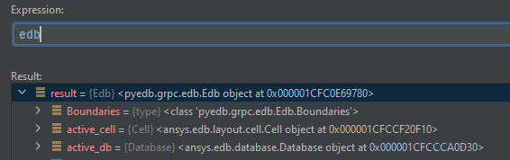

Loading layout
==============
Although an entire layout can be built from scratch with PyEDB most of the time the first step is
loading an existing aedb file. This section is showing how to load an EDB and start manipulating
objects.

.. code:: python

    from pyedb.grpc.edb import Edb
    edb_file = r"C:\Temp\My_edb_file.aedb"
    edb = Edb(edbversion="2024.1", edbpath=edb_file, port=50001)

