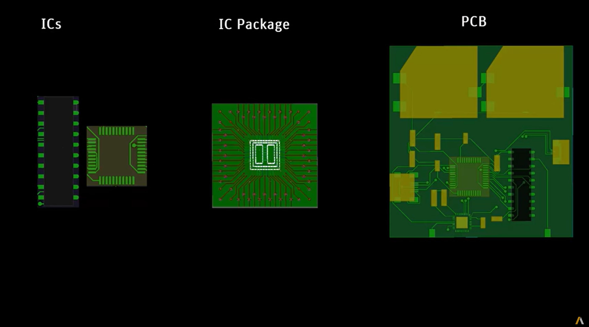

=============
API reference
=============

This section describes EDB functions, classes, and methods
for EDB apps and modules. Use the search feature or click links
to view API documentation.

The PyEDB API includes classes for apps and modules. You must initialize the
``Edb`` class to get access to all modules and methods. All other classes and
methods are inherited into the ``Edb`` class.

If EDB is launched within the ``HfssdLayout`` class, EDB is accessible in read-only mode.

**Example**

.. code:: python

    from pyedb import Edb

    edb = Edb("my_project.aedb", edbversion="2023.1")
    edb.core_components.components["R1"].r_value = 40
    edb.close_edb()

.. toctree::
   :maxdepth: 2

   CoreEdb
   edb_data/index
   sim_setup_data/data/index
   sim_setup_data/io/index
   utilities/index
   SiWave
   SimulationConfigurationv2

