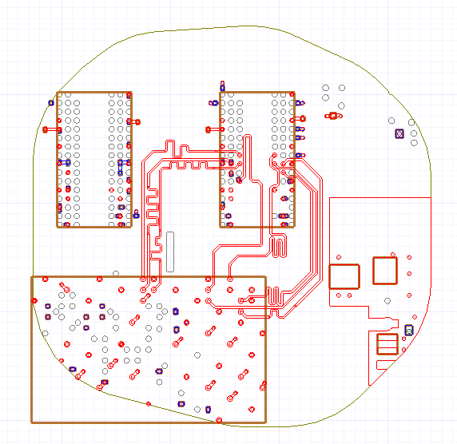

Clipping layout
===============
Because most of the time only a specific part of a layout must be simulated, clipping the design
needs to be performed to reduce computer resources and speed up simulation. This section describes
how to clip a design based on nets selection.

.. autosummary::
   :toctree: _autosummary

.. code:: python

    from pyedb.dotnet import Edb
    from pyedb.generic.general_methods import generate_unique_folder_name
    import pyedb.misc.downloads as downloads

    # Ansys release version
    ansys_version = "2023.2"

    # download and copy the layout file from examples
    temp_folder = generate_unique_folder_name()
    targetfile = downloads.download_file("edb/ANSYS-HSD_V1.aedb", destination=temp_folder)

    # loading EDB
    edbapp = Edb(edbpath=targetfile, edbversion="2023.2")

    # selecting signal nets to evaluate the extent for clipping the layout
    signal_nets = [
        "DDR4_DQ0",
        "DDR4_DQ1",
        "DDR4_DQ2",
        "DDR4_DQ3",
        "DDR4_DQ4",
        "DDR4_DQ5",
        "DDR4_DQ6",
        "DDR4_DQ7",
    ]
    # at least one reference net must be included. Reference nets are included in the design but clipped.
    reference_nets = ["GND"]
    # defining the expansion factor. The value gives the distance for evaluating the cutout extent. Here we define a cutout
    expansion = 0.01  # 1cm in this case
    # processing cutout
    edbapp.cutout(
        signal_list=signal_nets, reference_list=reference_nets, expansion_size=expansion
    )
    # save and close project
    edbapp.save_edb()
    edbapp.close_edb()

