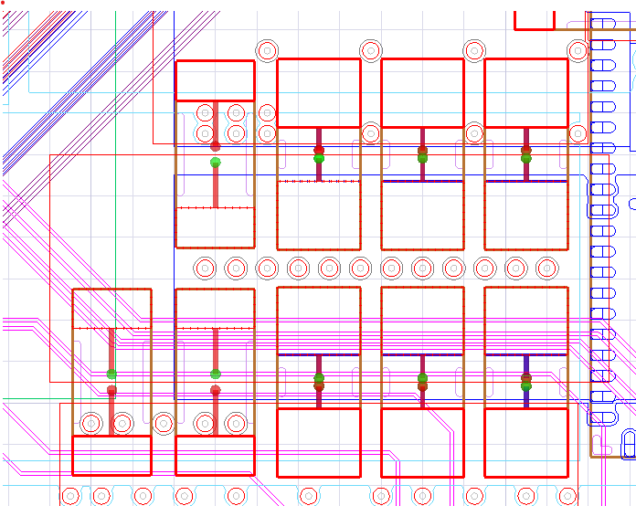

.. _replace_rlc_component_by_port_example:

Replace RLC component by port
=============================

This page shows how to deactivate RLC components and create ports between pads:

.. autosummary::
   :toctree: _autosummary

.. code:: python

    from pyedb import Edb
    from pyedb.generic.general_methods import generate_unique_folder_name
    import pyedb.misc.downloads as downloads

    temp_folder = generate_unique_folder_name()
    targetfile = downloads.download_file("edb/ANSYS-HSD_V1.aedb", destination=temp_folder)
    edbapp = Edb(edbpath=targetfile, edbversion="2025.2")

    # All capacitors are converted into port
    for refdes, component in edbapp.components.capacitors.items():
        if not edbapp.components.deactivate_rlc_component(
            component=refdes, create_circuit_port=True
        ):
            edbapp.logger.warning(f"Failed converting capacitor {refdes} into port")
    edbapp.save()
    edbapp.close()

