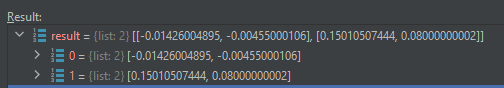

.. _edb_queries_layout_bbox_example:

Get layout size
===============

This tutorial shows how to retrieve the layout size by getting the bounding box.

.. autosummary::
   :toctree: _autosummary

.. code:: python

    from pyedb import Edb
    from pyedb.generic.general_methods import generate_unique_folder_name
    import pyedb.misc.downloads as downloads

    temp_folder = generate_unique_folder_name()
    targetfile = downloads.download_file("edb/ANSYS-HSD_V1.aedb", destination=temp_folder)
    edbapp = Edb(edbpath=targetfile, edbversion="2024.2")

    edbapp.get_bounding_box()

