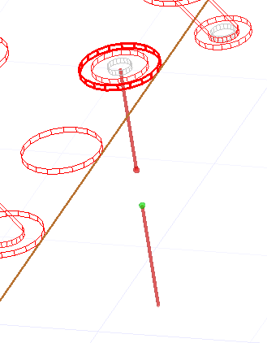

.. _create_port_between_pin_and_layer_example:

Create port between a pin and layer
===================================

This page shows how to create a port between a pin and a layer.

.. autosummary::
   :toctree: _autosummary

.. code:: python

    from pyedb import Edb
    from pyedb.generic.general_methods import generate_unique_folder_name
    import pyedb.misc.downloads as downloads

    # Ansys release version
    ansys_version = "2024.2"

    # download and copy the layout file from examples
    temp_folder = generate_unique_folder_name()
    targetfile = downloads.download_file("edb/ANSYS-HSD_V1.aedb", destination=temp_folder)

    # load EDB
    edbapp = Edb(edbpath=targetfile, edbversion="2024.2")

    edbapp.siwave.create_port_between_pin_and_layer(
        component_name="U1", pins_name="A27", layer_name="16_Bottom", reference_net="GND"
    )
    U7 = edbapp.components["U7"]
    _, pin_group = edbapp.siwave.create_pin_group_on_net(
        reference_designator="U7", net_name="GND", group_name="U7_GND"
    )
    U7.pins["F7"].create_port(reference=pin_group)
    edbapp.save_edb()
    edbapp.close_edb()

