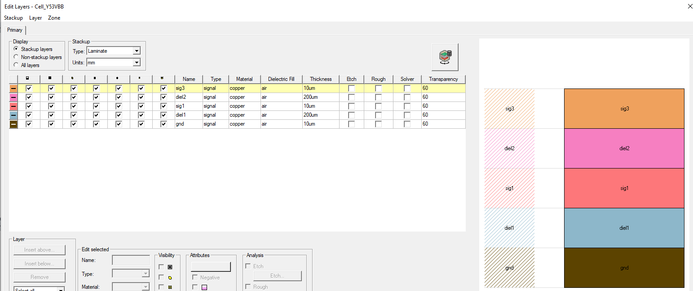

.. _define_layer_stackup_example:

Add a layer in a layout stackup
===============================

This page shows how to add a layer in the current layer stackup.

.. autosummary::
   :toctree: _autosummary

.. code:: python

    from pyedb import Edb

    edb = Edb(edbversion=desktop_version)
    edb.stackup.add_layer(layer_name="gnd", fillMaterial="AIR", thickness="10um")
    edb.stackup.add_layer(
        layer_name="diel1", fillMaterial="AIR", thickness="200um", base_layer="gnd"
    )
    edb.stackup.add_layer(
        layer_name="sig1", fillMaterial="AIR", thickness="10um", base_layer="diel1"
    )
    edb.stackup.add_layer(
        layer_name="diel2", fillMaterial="AIR", thickness="200um", base_layer="sig1"
    )
    edb.stackup.add_layer(
        layer_name="sig3", fillMaterial="AIR", thickness="10um", base_layer="diel2"
    )
    edb.close()

