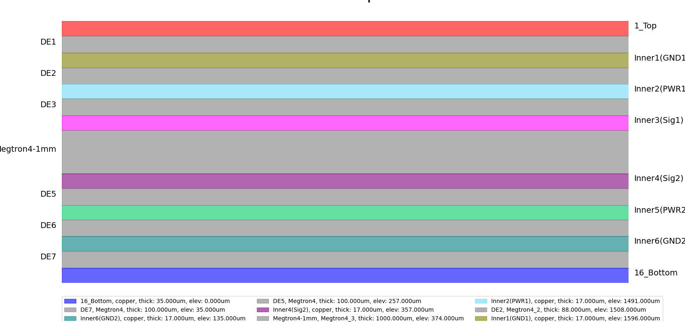

.. _layer_stackup_example:

Checking and editing layer stackup
==================================
This section describes how to edit layer stackup:

.. autosummary::
   :toctree: _autosummary

.. code:: python

    from pyedb.dotnet.edb import Edb
    from pyedb.generic.general_methods import generate_unique_folder_name
    import pyedb.misc.downloads as downloads

    temp_folder = generate_unique_folder_name()
    targetfile = downloads.download_file("edb/ANSYS-HSD_V1.aedb", destination=temp_folder)
    edbapp = Edb(edbpath=targetfile, edbversion="2023.2")

    # plotting layer stackup in matplotlib
    edbapp.stackup.plot()
    # changing top layer thickness to 40um
    edbapp.stackup.signal_layers["1_Top"].thickness = 40e-6
    print(f"Top layer thickness update {edbapp.stackup.signal_layers['1_Top'].thickness}")
    edbapp.save()
    edbapp.close()

:width: 800
:alt: Layer stackup plot

.. code:: python

    # retrieving signal layers name
    signal_layers = list(edbapp.stackup.signal_layers.keys())

    # selecting top layer
    top_layer = edbapp.stackup.signal_layers[signal_layers[0]]

    # Stackup total thickness
    layout_stats = edbapp.get_statistics()
    layout_stats.stackup_thickness

    # setting all signal layers thickness to 20um
    for layer_name, layer in edbapp.stackup.signal_layers.items():
        layer.thickness = "20um"

    edbapp.materials.add_material(
        name="MyMaterial", permittivity=4.35, dielectric_loss_tangent=2e-4
    )
    edbapp.materials.add_material(name="MyMetal", conductivity=1e7)
    for layer in list(edbapp.stackup.dielectric_layers.values()):
        layer.material = "MyMaterial"
    for layer in list(edbapp.stackup.signal_layers.values()):
        layer.material = "MyMetal"
    edbapp.materials.add_material(
        name="SolderMask", permittivity=3.8, dielectric_loss_tangent=1e-3
    )
    edbapp.stackup.add_layer(
        layer_name="Solder_mask",
        base_layer="1_Top",
        thickness="200um",
        material="SolderMask",
    )

