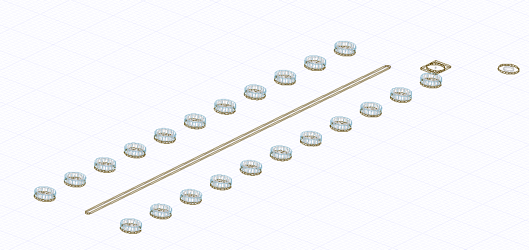

.. _create_padstack_instance_example:

Create a padstack instance
==========================

This page shows how to create a padstack instance.

.. autosummary::
   :toctree: _autosummary

.. code:: python

    from pyedb import Edb

    edb = Edb(edbversion=desktop_version)
    edb.stackup.add_layer(layer_name="1_Top", fillMaterial="AIR", thickness="30um")
    edb.stackup.add_layer(
        layer_name="contact", fillMaterial="AIR", thickness="100um", base_layer="1_Top"
    )

    edb.padstacks.create(
        pad_shape="Rectangle",
        padstackname="pad",
        x_size="350um",
        y_size="500um",
        holediam=0,
    )
    pad_instance1 = edb.padstacks.place(
        position=["-0.65mm", "-0.665mm"], definition_name="pad"
    )
    pad_instance1.start_layer = "1_Top"
    pad_instance1.stop_layer = "1_Top"

    edb.padstacks.create(
        pad_shape="Circle", padstackname="pad2", paddiam="350um", holediam="15um"
    )
    pad_instance2 = edb.padstacks.place(
        position=["-0.65mm", "-0.665mm"], definition_name="pad2"
    )

    pad_instance2.start_layer = "1_Top"
    pad_instance2.stop_layer = "1_Top"

    edb.padstacks.create(
        pad_shape="Circle",
        padstackname="test2",
        paddiam="400um",
        holediam="200um",
        antipad_shape="Rectangle",
        anti_pad_x_size="700um",
        anti_pad_y_size="800um",
        start_layer="1_Top",
        stop_layer="1_Top",
    )

    pad_instance3 = edb.padstacks.place(
        position=["-1.65mm", "-1.665mm"], definition_name="test2"
    )
    pad_instance3.dcir_equipotential_region = True
    pad_instance3.dcir_equipotential_region = False

    trace = edb.modeler.create_trace(
        [[0, 0], [0, 10e-3]], "1_Top", "0.1mm", "trace_with_via_fence"
    )
    edb.padstacks.create_padstack("via_0")
    trace.create_via_fence("1mm", "1mm", "via_0")
    edb.save()
    edb.close()

