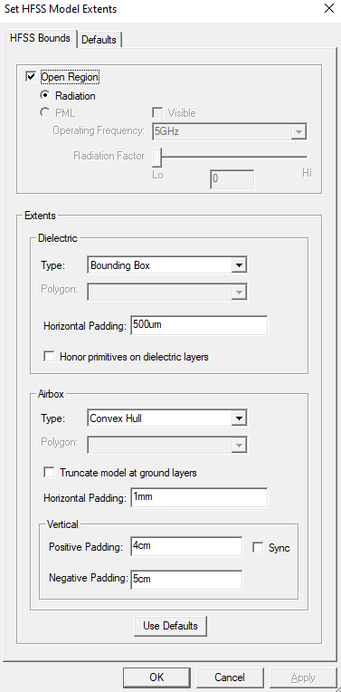

.. _define_hfss_extent_example:

Define an HFSS extent
=====================

This page shows how to define an HFSS extent using the ``SimulationConfiguration`` class.

.. autosummary::
   :toctree: _autosummary

.. code:: python

    from pyedb import Edb

    # create EDB
    edb = Edb()

    # add stackup layers
    edb.stackup.add_layer(layer_name="GND", fillMaterial="AIR", thickness="30um")
    edb.stackup.add_layer(layer_name="FR4", base_layer="gnd", thickness="250um")
    edb.stackup.add_layer(layer_name="SIGNAL", base_layer="FR4", thickness="30um")

    # create trace
    edb.modeler.create_trace(
        layer_name="SIGNAL", width=0.02, net_name="net1", path_list=[[-1e3, 0, 1e-3, 0]]
    )

    # create primitive rectangle
    edb.modeler.create_rectangle(
        layer_name="GND",
        representation_type="CenterWidthHeight",
        center_point=["0mm", "0mm"],
        width="4mm",
        height="4mm",
        net_name="GND",
    )

    # create ``SimulationConfiguration`` object
    sim_setup = edb.new_simulation_configuration()

    #  define air box settings
    sim_setup.use_dielectric_extent_multiple = False
    sim_setup.use_airbox_horizontal_extent_multiple = False
    sim_setup.use_airbox_negative_vertical_extent_multiple = False
    sim_setup.use_airbox_positive_vertical_extent_multiple = False
    sim_setup.dielectric_extent = 0.0005
    sim_setup.airbox_horizontal_extent = 0.001
    sim_setup.airbox_negative_vertical_extent = 0.05
    sim_setup.airbox_positive_vertical_extent = 0.04

    # disable frequency sweep creation
    sim_setup.add_frequency_sweep = False

    # include only selected nets
    sim_setup.include_only_selected_nets = True

    # disable cutout
    sim_setup.do_cutout_subdesign = False

    # disable port generation
    sim_setup.generate_excitations = False

    # build project
    edb.build_simulation_project(sim_setup)
    edb.save()
    edb.close()

